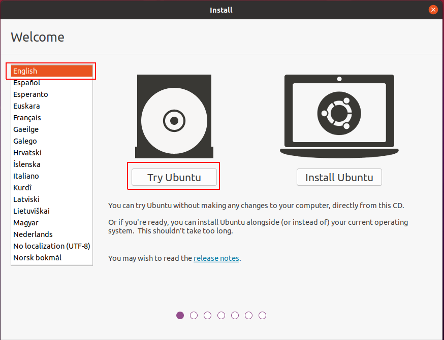
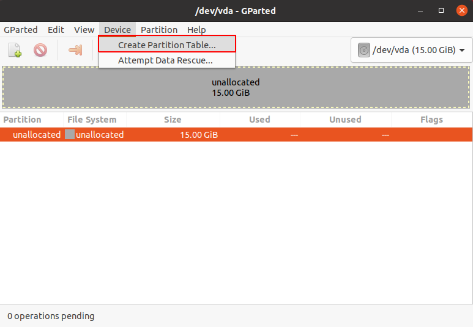
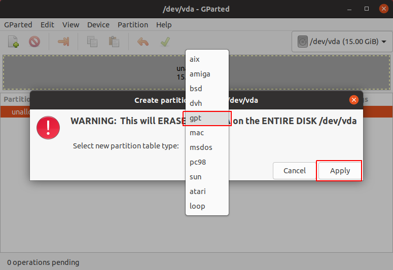
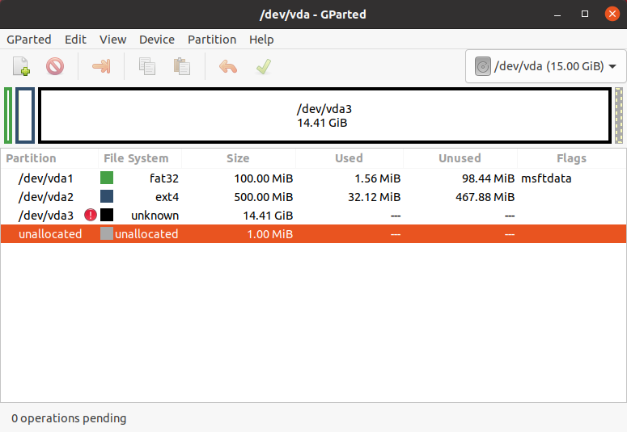
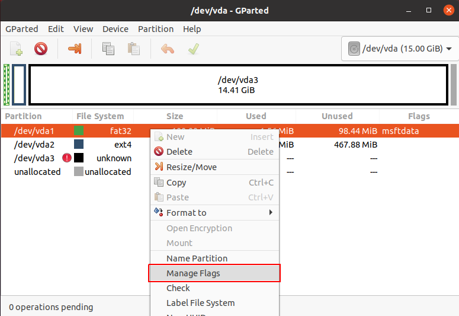
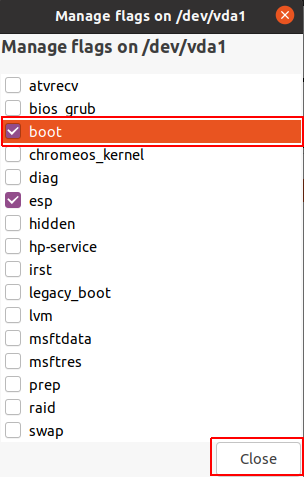
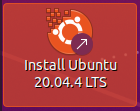
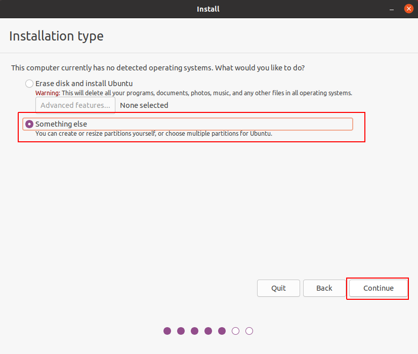
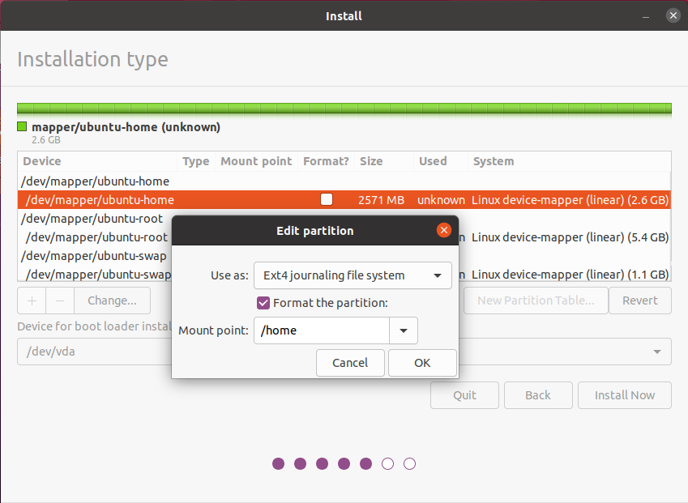

# Installing Ubuntu with LUKS and LVM
By [Zidmann](mailto:emmanuel.zidel@gmail.com) :bow:

## Global presentation
This demo was done with an Ubuntu 20.04.4 image installed on a virtual machine which virtualizes a UEFI motherboard.
One single virtual disk (/dev/vda) is used with a GPT partition table.

Then, depending on the situation, you will need to adapt the commands to your needs (dual boot Linux/Windows, several disks, separate partitions) :
* the encrypted partition is be /dev/vda3
* the logical LUKS partition is /dev/mapper/vda3_crypt
* the LVM volume group is 'ubuntu'
* the LVM logical volumes are 'root', 'swap', 'tmp', 'home'

To start with, launch the installation image, then choose your language and click on **"Try Ubuntu"** button.



If necessary, you can open a terminal and change the keyboard configuration with the command **setxkbmap**.

## Building the partitions

**Step 1** : Identify the partition to format
```bash
> lsblk
NAME  MAJ:MIN RM   SIZE RO TYPE MOUNTPOINT
NAME              MAJ:MIN RM   SIZE RO TYPE  MOUNTPOINT
loop0               7:0    0   2.1G  1 loop  /rofs
loop1               7:1    0     4K  1 loop  /snap/bare/5
loop2               7:2    0 248.8M  1 loop  /snap/gnome-3-38-2004/99
loop3               7:3    0  54.2M  1 loop  /snap/snap-store/558
loop4               7:4    0  61.9M  1 loop  /snap/core20/1328
loop5               7:5    0  65.2M  1 loop  /snap/gtk-common-themes/1519
loop6               7:6    0  43.6M  1 loop  /snap/snapd/14978
sr0                11:0    1   3.2G  0 rom   /cdrom
vda               252:0    0    15G  0 disk                                <------------------- here
```

The next commands are launched with 'root' user.

**Step 2** : Create a table partition

Launch **gparted** tool.
```bash
> gparted
```

If it is not done yet, a GPT partition table must be created :
* Device > Create Partition Table


* Select **'gpt'** as partition table type, then click on **"Apply"** button


Then you need to create 3 partitions :
* /dev/vda1 a fat32 partitions with a size of 100Mb for the **UEFI image**
* /dev/vda2 an ext4 partitions with a size of 500Mb for the **boot**
* /dev/vda3 a partition cleared with all the remaining space for the **encrypted data**


Next, you add the flag **boot** on /dev/vda1. It is possible that **esp** flag is automatically set.
 

**Step 3** : Create the LUKS partition

```bash
> cryptsetup --verify-passphrase --hash=sha512 --key-size 512 luksFormat /dev/vda3

WARNING!
========
This will overwrite data on /dev/vda3 irrevocably.

Are you sure? (Type uppercase yes): YES
Enter passphrase for /dev/vda3: 
Verify passphrase: 

> cryptsetup luksOpen /dev/vda3 vda3_crypt
Enter passphrase for /dev/vda3:

> ls /dev/mapper
control  vda3_crypt
```

By default, LUKS should have used **AES-XTS** encryption algorithm with **argon2i** as derivation function.
You can check it by :
```bash
> cryptsetup luksDump /dev/vda3
LUKS header information
[...]

Data segments:
  0: crypt
[...]
	cipher: aes-xts-plain64
	sector: 512 [bytes]

Keyslots:
  0: luks2
        Key:        512 bits
[...]
        Cipher:     aes-xts-plain64
        Cipher key: 512 bits
        PBKDF:      argon2i
[...]
        AF hash:    sha512
[...]
Tokens:
Digests:
  0: pbkdf2
        Hash:       sha512
[...]
```

**Step 4** : Create the LVM volume and partitions
```bash
> pvcreate /dev/mapper/vda3_crypt
  Physical volume "/dev/mapper/vda3_crypt" successfully created.

> vgcreate ubuntu /dev/mapper/vda3_crypt
  Volume group "ubuntu" successfully created

> lvcreate -n root -L 10g ubuntu
  Logical volume "root" created.
> lvcreate -n swap -L 1g ubuntu
  Logical volume "swap" created.
> lvcreate -n tmp  -L 1g ubuntu
  Logical volume "tmp" created.
> lvcreate -n home -l 100%FREE ubuntu
  Logical volume "home" created.

> ls /dev/mapper
control  ubuntu-home  ubuntu-root  ubuntu-swap  ubuntu-tmp  vda3_crypt
```

## Installing Ubuntu

Click on the icon **Install Ubuntu 20.04.4LTS** on the desktop.



In the opened install menu do these steps as you want :
* Welcome : choose your language
* Keyboard layout
* Updates and other software
* Installation type : choose the option **"something else"** and click on **"Continue"** button.


This configuration was used for the demo :
| Device | Use as | Format | Mount point |
|--------|--------|--------|-------------|
| /dev/mapper/ubuntu-home | ext4 | X | /home |
| /dev/mapper/ubuntu-root | ext4 | X | / |
| /dev/mapper/ubuntu-swap | swap | | |
| /dev/mapper/ubuntu-tmp | ext4 | X | /tmp |
| /dev/vda1 | fat32 |  | /boot/efi |
| /dev/vda2 | ext4 | X | /boot |



**!! WARNING !!** Keep in mind to not format UEFI (/boot/efi) partition if you use several operating systems.

* Do the last steps of the installation and wait. You should let the installation to download the last updates because it solves some problems which sometimes happens (like with the boot-loader).

**!! WARNING !!** Do not restart immediately : the installer does not understand what you did with the partitions and let the system in an unusable  state.


## Updating the crypttab and the kernel configuration

**Step 1** : Mount the system partitions

```bash
> mount /dev/mapper/ubuntu-root /mnt
> mount /dev/vda2 /mnt/boot
> mount /dev/vda1 /mnt/boot/efi
> mount /dev/mapper/ubuntu-home /mnt/home
> mount /dev/mapper/ubuntu-tmp /mnt/tmp
> mount --bind /dev /mnt/dev
> mount -t proc /proc /mnt/proc
> mount -t sysfs /sys /mnt/sys
> mount -t devpts devpts /mnt/dev/pts
```

**Step 2** : Update the cryttab

```bash
> chroot /mnt/
> blkid /dev/vda3
```

Complete the file with these lines with the previous UUID :
```
> nano /etc/crypttab

# <target_name> <source_device> <key_file> <options>
vda3_crypt UUID=5c716032-6a35-4904-b2ce-7b473cfb99ad none luks
```

**Step 3** : Update the kernels

```bash
> update-initramfs -k all -c
```
Use **'-k all -c'** options instead of only **'-u'** since the first choice updates all the kernels and the second only the last one.

**Step 4** : Reboot the machine

```bash
> exit
> reboot 
```

## Protecting the partition against disk corruption
As explained in **[README.md](./README.md)** if the header of a LUKS volume gets damaged, all data is permanently lost unless a header-backup is available.
Then, to make a dump of the header:
```bash
> cryptsetup luksHeaderBackup --header-backup-file <file> /dev/<partition>
```

## References
* https://www.man7.org/linux/man-pages/man5/crypttab.5.html
* https://www.youtube.com/watch?v=l7xEDeQc4Rw
* https://www.youtube.com/watch?v=iMGs7UMtluc
* https://www.youtube.com/watch?v=_icGBXIsvzE
* https://zestedesavoir.com/tutoriels/1653/installer-un-ubuntu-chiffre-avec-luks-lvm-et-un-partitionnement-personnalise/
