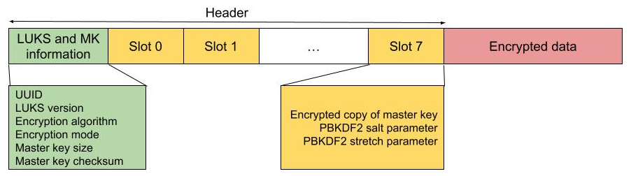

# Documentation LUKS
By [Zidmann](mailto:emmanuel.zidel@gmail.com) :bow:

## Global presentation


The **Linux Unified Key Setup (LUKS)** is a disk encryption specification created by _Clemens Fruhwirth_ in 2004 and was originally intended for Linux.

While most disk encryption software implements different, incompatible, and undocumented formats, LUKS implements a platform-independent standard on-disk format for use in various tools. 
This not only facilitates compatibility and interoperability among different programs, but also assures that they all implement passphrase management in a secure and documented manner.


The reference implementation for LUKS operates on Linux and is based on an enhanced version of **_cryptsetup_**, using **_dm-crypt_** as the disk encryption backend.

LUKS stores all necessary setup information in the partition header so transporting or migrating data is easy.

## Project 
The source code and the documentation of the project are open and accessible on [GitLab](https://gitlab.com/cryptsetup).

Some PDF files in the **[pdf](./pdf)** directory come from this project.

## Programs
LUKS commands are based on these programs :
* cryptsetup
* blkid

## Design




### _Master key and header_
When a partition is built with LUKS, the first sectors are called the header and describes information for the next use.
It is also possible to store the header in an external place as explained in **[EXTERNAL-HEADER.md](./EXTERNAL-HEADER.md)**.

Creating a LUKS partition requires a symmetric algorithm chosen by the user (or the default settings) and a master key randomly created.

The master key is used to encrypt the data blocks and *remains constant throughout the life of the encrypted partition*.
Then the header contains :
* the UUID
* the LUKS version used
* the encryption algorithm and mode
* the size and the checksum of the master key

The header also contains some slots which are explained below.

The master key is never directly stored in the header, but indirectly in the slots explained below with its encrypted forms.

If the header of a LUKS volume gets sufficiently damaged, all data is permanently lost unless a header-backup is available.
Damaging the LUKS header is something people manage to do with surprising frequency.
LUKS1 version is very sensitive since one single bit altered in the header can compromise it.
LUKS2 version has features such as resilience to header corruption, so the header is less sensitive but is not nesting.

This risk is the result of a trade-off between security and safety, as LUKS is designed for fast and secure wiping by just overwriting header and key-slot area.

### _Keys and slots_
When a normal user accesses a LUKS encrypted partition, he/she uses a passphrase (or a passphrase) but does not use the master key directly.

The passphrase is used to generate another key with a passphrase-based key derivation function (PBKDF) to encrypt the master key in a key slot.
To check if the passphrase is correct, a hash is used with a salt and an iteration count defined in the slot.


There are eight key slots, which can use different PBKDF algorithms, encrypting the same master key, but with different passphrases.

If a key-slot is damaged, it can only be restored from a header-backup or if another active key-slot with known passphrase is undamaged.

It is necessary to keep in mind that changing or removing a passphrase do not change the master key which implies :
* if an attacker managed to get at one moment one passphrase, it could copy the header, restore it later, then enter the previous passphrase to open the partition
* if an admin was granted a key slot, removing that slot does not assure he/she will not be anymore able to access to the content


If the security is compromised, it is necessary to change the master key and update all the blocks encrypted by the previous one.
A simpler way would be to create a new partition and move the files to it.

When a passphrase (or a file key) is used, it seems LUKS start reading slot 0, if the hash does not match it goes to the next slot, and repeats until the key matches or if there is no more slots.
Consequently decrypting a partition with a key stored in the last slots requires more time than a key stored in the first slots.
It is advised to store a user key in the first slots and the special/administrator access in the next ones.

## Install Ubuntu on a computer with LUKS and LVM
The procedure needing several steps, installing an Ubuntu image on a device with LUKS and LVM partitions is described in **[INSTALL.md](./INSTALL.md)** dedicated.

## Use LUKS with an external storage

### _Create a new LUKS partition with a passphrase_
```bash
> cryptsetup luksFormat --verify-passphrase [--hash=<hash_algorithm>] --key-size <key_size> /dev/<partition>
```

### _Open a LUKS partition_
* _with a passphrase_ :
```bash
> cryptsetup luksOpen /dev/<partition> <partition_name>
```

* _with a key file_ :
```bash
> cryptsetup luksOpen --key-file <key_file_path> /dev/<partition> <partition_name>
```

* _with the master key_ :
```bash
> cryptsetup luksOpen --master-key-file <master_key_path> /dev/<partition> <partition_name>
```

The partition **/dev/mapper/<partition_name>** will be opened, then a file system (like LVM or ext4) could be installed on it.
Usually we defined <partition_name>=\<partition\>_crypt

### _Close a LUKS partition_
When all the file systems in the encrypted partition were unmounted, use :

```bash
> cryptsetup luksClose /dev/mapper/<partition_name>
```

## Two-factor authentication with YubiKey
The procedure needing several steps, using a Yubikey with LUKS is described in **[TWO-FACTOR.md](./TWO-FACTOR.md)** dedicated.

## Common commands
When a LUKS partition is already defined and available, you can use these commands to handle the slots and their keys:

### _Create a LUKS key file_
```bash
> dd if=/dev/random of=<key_file_path> bs=1024 count=1
> chmod 600 <key_file_path>
```
The content of the LUKS file containing random data, it could be easier to read it with the command **_xxd_**.
To avoid any leak, the permissions of the key are changed.

### _List all the slots_
```bash
> cryptsetup luksDump /dev/<partition>
```

### _Add a new LUKS passphrase_
```bash
> cryptsetup luksAddKey [--hash=<hash_algorithm>] [--key-slot <slot_id>] /dev/<partition>
```

### _Add a new LUKS key file_
```bash
> cryptsetup luksAddKey [--hash=<hash_algorithm>] [--key-slot <slot_id>] /dev/<partition> <key_file_path>
```

### _Change a LUKS passphrase_
```bash
> cryptsetup luksChangeKey [--hash=<hash_algorithm>] [--key-slot <slot_id>] /dev/<partition>
```

### _Delete an existing LUKS passphrase_
```bash
> cryptsetup luksRemoveKey /dev/<partition>
```

**!! WARNING !!** Removing the last passphrase makes the LUKS partition permanently inaccessible.

### _Remove a slot_
```bash
> cryptsetup luksKillSlot /dev/<partition> <slot_id>
```

### _Dump LUKS master key information_
```bash
> cryptsetup luksDump --dump-master-key /dev/<partition>
```

The information gets are :
* the cipher name (like AES)
* the cipher mode (like xts-plain64)
* the payload offset
* the UUID
* the size of the master key (MK bits)
* the value of the master key (MK dump)

### _Dump a LUKS header_
```bash
> cryptsetup luksHeaderBackup --header-backup-file <file> /dev/<partition>
```

**!! WARNING !!** Nobody must access the header backup file except the administrators. Then, it is highly recommended storing it on an encrypted cloud storage.

### _Restore a LUKS header_
In case of disaster where our LUKS header gets broken, we can restore it by issuing the following command:
```bash
> cryptsetup luksHeaderRestore --header-backup-file <file> /dev/<partition>
```

Note that the LUKS header restoration procedure replaces all key-slots.
So only the passphrases or key files from the backup will work afterwards.

## Securely erase a LUKS header ##
The LUKS file system can be identified by checking its volume header:
```bash
> cryptsetup isLuks -v /dev/<partition>
```

It could be a disadvantage since it is readily obvious there is encrypted data on our disk. In some situations, this could interest some people or organizations who would force us to hand over the keys.
Erasing the LUKS header makes it impossible to recover any data from the LUKS volume unless a header backup is available.
```bash
# Get the payload offset of the partition
> cryptsetup luksDump --dump-master-key /dev/<partition>
# If you manage to give a valid passphrase, the field "Payload offset" contains the value you need later and called $PAYLOADOFFSET
> dd if=/dev/random of=/dev/<partition> bs=512 count=$PAYLOADOFFSET
```

## Evaluate the speed
It could be necessary to know the encryption performance with the storage of a device (like a hard drive, a SD card or an USB key).
In this case :
```bash
> cryptsetup benchmark

# Tests are approximate using memory only (no storage IO).
PBKDF2-sha1      xxxxxxx iterations per second for 256-bit key
PBKDF2-sha256    xxxxxxx iterations per second for 256-bit key
PBKDF2-sha512    xxxxxxx iterations per second for 256-bit key
PBKDF2-ripemd160 xxxxxxx iterations per second for 256-bit key
PBKDF2-whirlpool xxxxxxx iterations per second for 256-bit key
argon2i       4 iterations, xxxxxx memory, 4 parallel threads (CPUs) for 256-bit key (requested 2000 ms time)
argon2id      4 iterations, xxxxxx memory, 4 parallel threads (CPUs) for 256-bit key (requested 2000 ms time)
#     Algorithm |       Key |      Encryption |      Decryption
        aes-cbc        128b       xxx,x MiB/s       xxx,x MiB/s
    serpent-cbc        128b       xxx,x MiB/s       xxx,x MiB/s
    twofish-cbc        128b       xxx,x MiB/s       xxx,x MiB/s
        aes-cbc        256b       xxx,x MiB/s       xxx,x MiB/s
    serpent-cbc        256b       xxx,x MiB/s       xxx,x MiB/s
    twofish-cbc        256b       xxx,x MiB/s       xxx,x MiB/s
        aes-xts        256b       xxx,x MiB/s       xxx,x MiB/s
    serpent-xts        256b       xxx,x MiB/s       xxx,x MiB/s
    twofish-xts        256b       xxx,x MiB/s       xxx,x MiB/s
        aes-xts        512b       xxx,x MiB/s       xxx,x MiB/s
    serpent-xts        512b       xxx,x MiB/s       xxx,x MiB/s
    twofish-xts        512b       xxx,x MiB/s       xxx,x MiB/s
```

## Only for Linux ?
VeraCrypt can be used with **cryptsetup** in limited features.

## Algorithms
* AES, serpent, twofish are the algorithms used to encrypt the data blocks.
* argon2i, argon2id are the algorithms used to encrypt the passphrase
* sha1, sha256, sha512, ripemd160, whirlpool are the hash function used to check if the passphrase is correct

AES is a standard (Advanced Encryption Standard) which is only defined for key sizes 128, 192 and 256.
We suppose an AES encryption using a key with a size of 512 is in fact two different 256 keys applied successively.

## Security breach
A breach was published the 23rd of January 2017 and referenced as **CVE-2016-4484**.
The Debian initrd script for the cryptsetup package **2:1.7.3-2** and earlier allows physically proximate attackers to gain shell access via many log in attempts with an invalid passphrase.

This problem did not concern the encryption itself so the data were not accessible and concerned the GNU/Linux boot sequence.
If an attacker accesses the console of the machine, it just has to reboot it and enters several times "Enter" key several times, then a shell appears.

To view the version of cryptsetup :
```bash
> cryptsetup --version
```

## Tips
### Single passphrase
When the same passphrase in used in the different partitions of a device, when it boots you need to enter once this passphrase.

It is also possible to use a passphrase to decrypt one partition and stores on it a key file which can be used to decrypt the other partitions.
In this case, you can write in the configuration file **/etc/crypttab**:
```bash
# <target_name> <source_device> <key_file> <options>
```
Of course before describing a partition decrypted with a key, you must write the line of the partition which contains the key (like root partition).

### Containers
Instead of encrypting completely a partition or a disk with LUKS, it is possible to define a container which is a file using .img as extension.

The container can be built with the command below:
```bash
> dd if=/dev/zero of=<container_path> bs=1M count=<size>
```
Then, instead of writing "/dev/<partition>" in the previous commands, we use the container file path and we still use a "<partition_name>" which creates a **/dev/mapper/<partition_name>** partition.
Next, like with a partition we just have to create a file system, below an example with EXT4 and mount it:
```bash
> mkfs.ext4 /dev/mapper/luks-container-crypt
> mount /dev/mapper/<partition_name> /mnt
```

## References
* https://en.wikipedia.org/wiki/Linux_Unified_Key_Setup
* https://www.thegeekstuff.com/2016/03/cryptsetup-lukskey/
* https://gitlab.com/cryptsetup
* https://crypto.stackexchange.com/questions/24022/luks-multiple-key-slots-whats-the-intuition
* https://www.lisenet.com/2013/luks-add-keys-backup-and-restore-volume-header/
* https://sleeplessbeastie.eu/2019/04/10/how-to-erase-luks-header/
* https://kifarunix.com/automount-luks-encrypted-device-in-linux/
* https://korben.info/faille-cryptsetup-permet-dobtenir-acces-root-certaines-machines-linux.html
* https://unix.stackexchange.com/questions/119803/how-to-decrypt-luks-with-the-known-master-key
* https://newbedev.com/using-a-single-passphrase-to-unlock-multiple-encrypted-disks-at-boot
